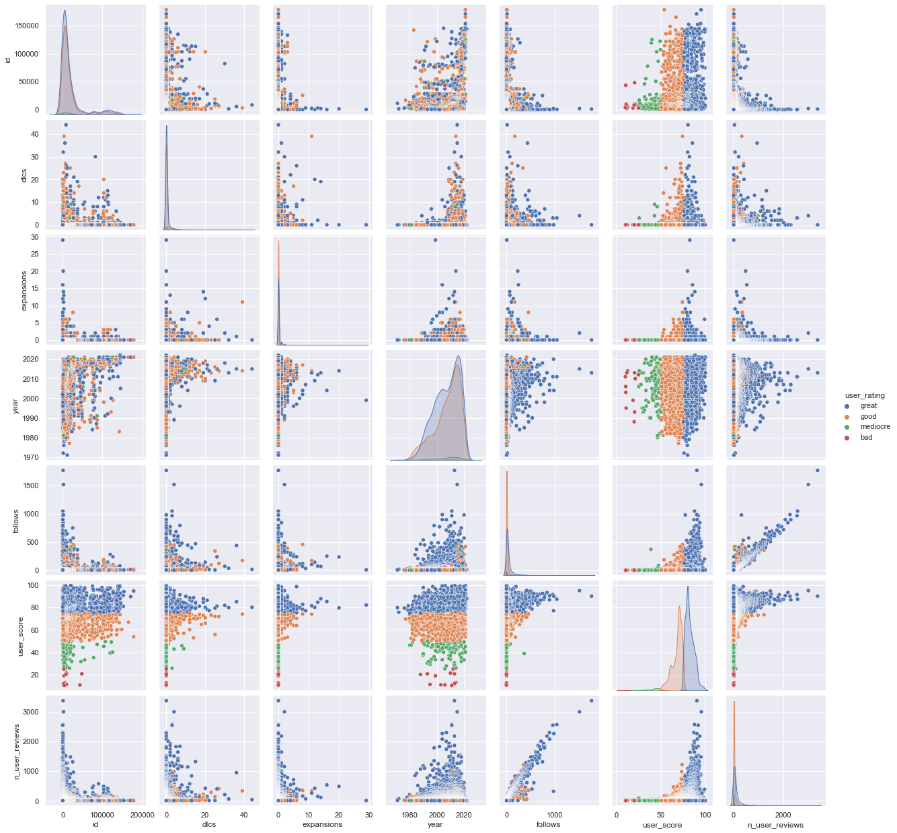
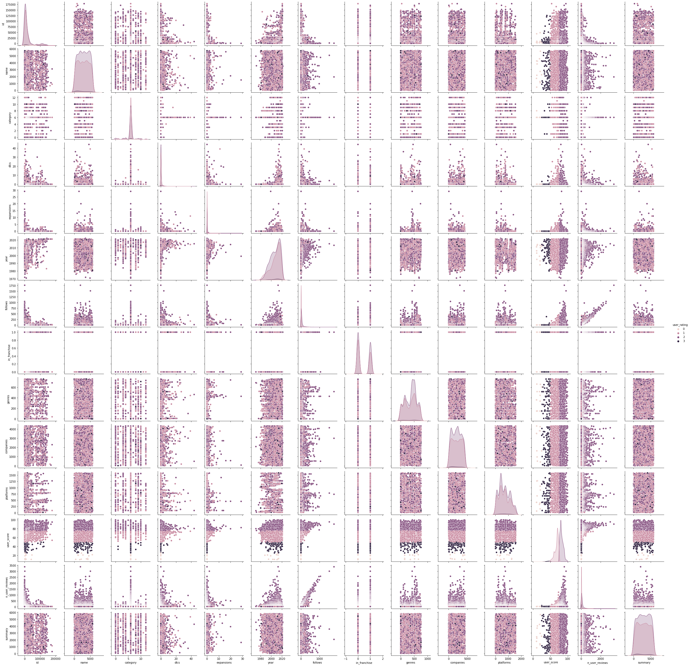
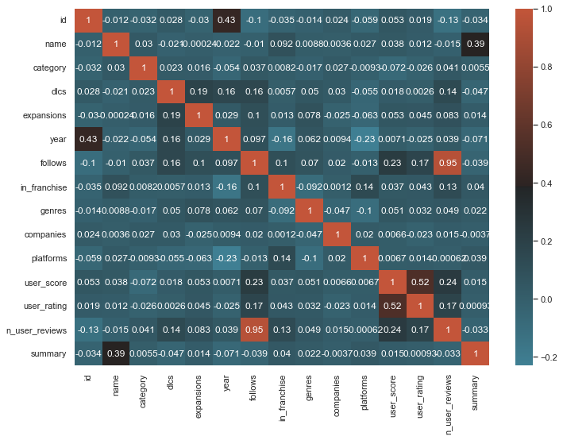
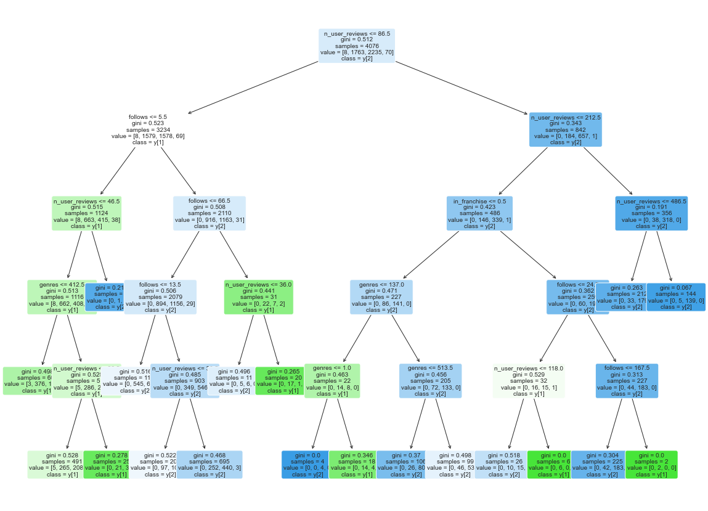
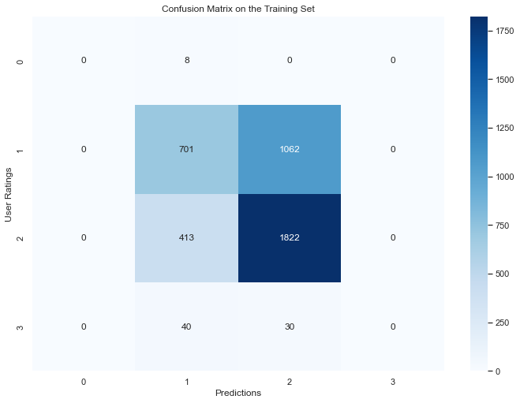
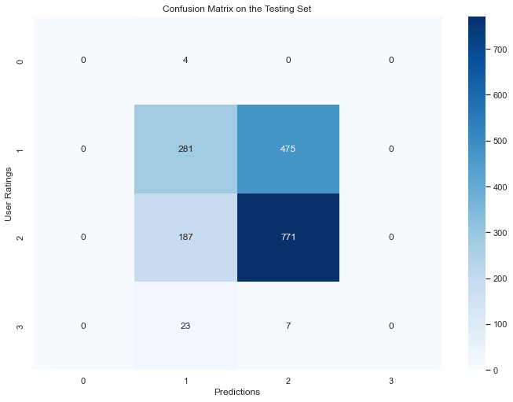
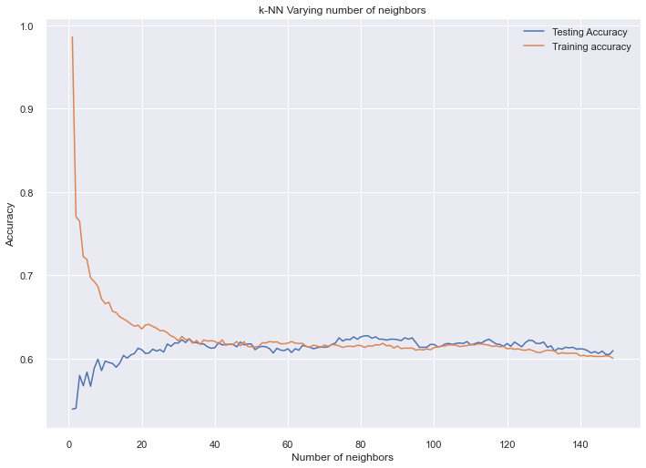
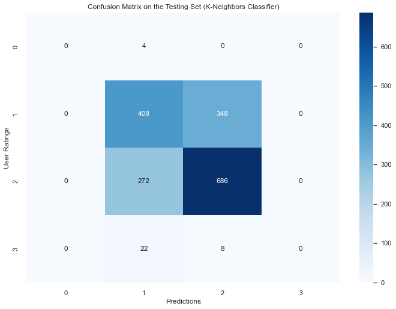
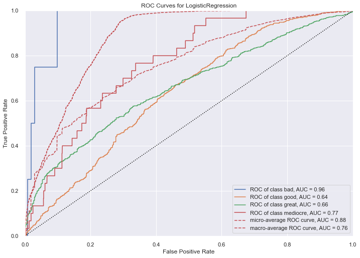

---
jupyter:
  interpreter:
    hash: c3503f95e0e8f4afdf6702396a7a2a29cae9f67572acfe092405dcaa2579b817
  kernelspec:
    display_name: Python 3.10.0 64-bit
    language: python
    name: python3
  language_info:
    codemirror_mode:
      name: ipython
      version: 3
    file_extension: .py
    mimetype: text/x-python
    name: python
    nbconvert_exporter: python
    pygments_lexer: ipython3
    version: 3.10.4
  nbformat: 4
  nbformat_minor: 2
  orig_nbformat: 4
---

::: {.cell .markdown}
# Game Review Prediction
:::

::: {.cell .markdown}
### Importing Libraries
:::

::: {.cell .code execution_count="1"}
``` {.python}
from IPython import get_ipython
get_ipython().run_line_magic('reset', '-sf')

import pandas as pd
import seaborn as sns
import numpy as np
import sklearn.preprocessing as sklp
import sklearn.model_selection as skms
import sklearn.tree as sktree
import sklearn.neighbors as sknn
import sklearn.metrics as skm
import sklearn.dummy as skd
import sklearn as sk
import matplotlib.pyplot as plt
```
:::

::: {.cell .markdown}
### Loading Data

This dataset contains the rating and various other atributes from almost
6,000 games. There are many atributes like year of release, genre,
number of follows, and the target atribute of prediction: rating.

**Feature description**:

**DLC\'s and Expansions**: The amount of unlockable content the game
has, worth noting that expansions are contained in the DLC\'s, so DLC\'s
\>= Expansions will always be true.

**year**: Year of the game release.

**follows**: Number of users following the game. (IGDB)

**in_franchise**: A boolean value that represents True if a game is
inside a franchise (e.g., "Star Wars Racer" → True since it belongs to
the Star Wars franchise)

**genres**: The genres of a specific game, we will encode this data in
order to get every combination of genres we have, and in the future,
correlate genres with reviews.

**companies**: The companies that developed/published the game.

**platforms**: The platforms the games are available on.

**user_score**: A numerical value of the game review.

**user_rating**: A categorical value of the game reviews, stated as
either bad, mediocre, good or great, each one represents 25% of the
user_score.

**n_user_reviews**: The amount of user reviews.

**summary**: A brief summary of the game.
:::

::: {.cell .code execution_count="2"}
``` {.python}
games = pd.read_csv('video_games.csv', sep=',')
games.columns = ['ID','Name','Category',"DLC's", "Expansions", 'year', 'follows','in_franchise','genres','companies','platforms','user_score','user_rating','n_user_reviews','summary']
games.head()
```

::: {.output .execute_result execution_count="2"}
```{=html}
<div>
<style scoped>
    .dataframe tbody tr th:only-of-type {
        vertical-align: middle;
    }

    .dataframe tbody tr th {
        vertical-align: top;
    }

    .dataframe thead th {
        text-align: right;
    }
</style>
<table border="1" class="dataframe">
  <thead>
    <tr style="text-align: right;">
      <th></th>
      <th>ID</th>
      <th>Name</th>
      <th>Category</th>
      <th>DLC's</th>
      <th>Expansions</th>
      <th>year</th>
      <th>follows</th>
      <th>in_franchise</th>
      <th>genres</th>
      <th>companies</th>
      <th>platforms</th>
      <th>user_score</th>
      <th>user_rating</th>
      <th>n_user_reviews</th>
      <th>summary</th>
    </tr>
  </thead>
  <tbody>
    <tr>
      <th>0</th>
      <td>1020</td>
      <td>Grand Theft Auto V</td>
      <td>main_game</td>
      <td>0</td>
      <td>0</td>
      <td>2013</td>
      <td>1766</td>
      <td>True</td>
      <td>Shooter, Adventure</td>
      <td>Rockstar North, Rockstar Games, Take-Two Inter...</td>
      <td>PC (Microsoft Windows), PlayStation 3, Xbox 36...</td>
      <td>90.202388</td>
      <td>great</td>
      <td>3369</td>
      <td>Grand Theft Auto V is a vast open world game s...</td>
    </tr>
    <tr>
      <th>1</th>
      <td>1942</td>
      <td>The Witcher 3: Wild Hunt</td>
      <td>main_game</td>
      <td>4</td>
      <td>2</td>
      <td>2015</td>
      <td>1516</td>
      <td>True</td>
      <td>Role-playing (RPG), Adventure</td>
      <td>WB Games, Bandai Namco Entertainment, cdp.pl, ...</td>
      <td>PC (Microsoft Windows), PlayStation 4, Xbox On...</td>
      <td>95.169577</td>
      <td>great</td>
      <td>2997</td>
      <td>RPG and sequel to The Witcher 2 (2011), The Wi...</td>
    </tr>
    <tr>
      <th>2</th>
      <td>472</td>
      <td>The Elder Scrolls V: Skyrim</td>
      <td>main_game</td>
      <td>3</td>
      <td>0</td>
      <td>2011</td>
      <td>1046</td>
      <td>False</td>
      <td>Role-playing (RPG), Adventure</td>
      <td>Bethesda Game Studios, Bethesda Softworks</td>
      <td>PC (Microsoft Windows), PlayStation 3, Xbox 360</td>
      <td>87.508504</td>
      <td>great</td>
      <td>2567</td>
      <td>Skyrim reimagines and revolutionizes the open-...</td>
    </tr>
    <tr>
      <th>3</th>
      <td>72</td>
      <td>Portal 2</td>
      <td>main_game</td>
      <td>3</td>
      <td>0</td>
      <td>2011</td>
      <td>963</td>
      <td>True</td>
      <td>Shooter, Platform, Puzzle, Adventure</td>
      <td>Valve Corporation, Electronic Arts</td>
      <td>Linux, PC (Microsoft Windows), PlayStation 3, ...</td>
      <td>91.650705</td>
      <td>great</td>
      <td>2544</td>
      <td>Sequel to the acclaimed Portal (2007), Portal ...</td>
    </tr>
    <tr>
      <th>4</th>
      <td>71</td>
      <td>Portal</td>
      <td>main_game</td>
      <td>0</td>
      <td>0</td>
      <td>2007</td>
      <td>894</td>
      <td>True</td>
      <td>Shooter, Platform, Puzzle</td>
      <td>Valve Corporation, EA</td>
      <td>Linux, PC (Microsoft Windows), PlayStation 3, ...</td>
      <td>86.931758</td>
      <td>great</td>
      <td>2297</td>
      <td>Waking up in a seemingly empty laboratory, the...</td>
    </tr>
  </tbody>
</table>
</div>
```
:::
:::

::: {.cell .code execution_count="3"}
``` {.python}
games.describe()
```

::: {.output .execute_result execution_count="3"}
```{=html}
<div>
<style scoped>
    .dataframe tbody tr th:only-of-type {
        vertical-align: middle;
    }

    .dataframe tbody tr th {
        vertical-align: top;
    }

    .dataframe thead th {
        text-align: right;
    }
</style>
<table border="1" class="dataframe">
  <thead>
    <tr style="text-align: right;">
      <th></th>
      <th>ID</th>
      <th>DLC's</th>
      <th>Expansions</th>
      <th>year</th>
      <th>follows</th>
      <th>user_score</th>
      <th>n_user_reviews</th>
    </tr>
  </thead>
  <tbody>
    <tr>
      <th>count</th>
      <td>5824.000000</td>
      <td>5824.000000</td>
      <td>5824.000000</td>
      <td>5824.000000</td>
      <td>5824.000000</td>
      <td>5824.000000</td>
      <td>5824.000000</td>
    </tr>
    <tr>
      <th>mean</th>
      <td>18508.000515</td>
      <td>0.450721</td>
      <td>0.120707</td>
      <td>2007.293784</td>
      <td>35.428056</td>
      <td>75.115510</td>
      <td>86.186470</td>
    </tr>
    <tr>
      <th>std</th>
      <td>30546.018723</td>
      <td>2.150920</td>
      <td>0.811236</td>
      <td>9.342881</td>
      <td>85.026280</td>
      <td>10.197815</td>
      <td>194.781917</td>
    </tr>
    <tr>
      <th>min</th>
      <td>1.000000</td>
      <td>0.000000</td>
      <td>0.000000</td>
      <td>1971.000000</td>
      <td>0.000000</td>
      <td>10.266748</td>
      <td>11.000000</td>
    </tr>
    <tr>
      <th>25%</th>
      <td>2271.750000</td>
      <td>0.000000</td>
      <td>0.000000</td>
      <td>2001.000000</td>
      <td>5.000000</td>
      <td>69.937370</td>
      <td>16.000000</td>
    </tr>
    <tr>
      <th>50%</th>
      <td>7258.000000</td>
      <td>0.000000</td>
      <td>0.000000</td>
      <td>2009.000000</td>
      <td>11.000000</td>
      <td>76.258903</td>
      <td>28.000000</td>
    </tr>
    <tr>
      <th>75%</th>
      <td>18581.250000</td>
      <td>0.000000</td>
      <td>0.000000</td>
      <td>2015.000000</td>
      <td>28.000000</td>
      <td>81.695739</td>
      <td>67.000000</td>
    </tr>
    <tr>
      <th>max</th>
      <td>178351.000000</td>
      <td>44.000000</td>
      <td>29.000000</td>
      <td>2022.000000</td>
      <td>1766.000000</td>
      <td>99.738172</td>
      <td>3369.000000</td>
    </tr>
  </tbody>
</table>
</div>
```
:::
:::

::: {.cell .code execution_count="4"}
``` {.python}
games = games.rename(columns={'ID':'id', 'Name':'name','Category':'category',"DLC's":'dlcs','Expansions':'expansions'})
games.info()
```

::: {.output .stream .stdout}
    <class 'pandas.core.frame.DataFrame'>
    RangeIndex: 5824 entries, 0 to 5823
    Data columns (total 15 columns):
     #   Column          Non-Null Count  Dtype  
    ---  ------          --------------  -----  
     0   id              5824 non-null   int64  
     1   name            5824 non-null   object 
     2   category        5824 non-null   object 
     3   dlcs            5824 non-null   int64  
     4   expansions      5824 non-null   int64  
     5   year            5824 non-null   int64  
     6   follows         5824 non-null   int64  
     7   in_franchise    5824 non-null   bool   
     8   genres          5803 non-null   object 
     9   companies       5781 non-null   object 
     10  platforms       5824 non-null   object 
     11  user_score      5824 non-null   float64
     12  user_rating     5824 non-null   object 
     13  n_user_reviews  5824 non-null   int64  
     14  summary         5816 non-null   object 
    dtypes: bool(1), float64(1), int64(6), object(7)
    memory usage: 642.8+ KB
:::
:::

::: {.cell .code execution_count="5"}
``` {.python}
gamesnumerical = ["id", "dlcs", "expansions", "year", "follows", "user_score", "n_user_reviews", "user_rating"]
gamesNumerical = games[gamesnumerical]
```
:::

::: {.cell .code execution_count="27"}
``` {.python}
gamesNumericalPlot = sns.pairplot(gamesNumerical, hue='user_rating')
```

::: {.output .display_data}

:::
:::

::: {.cell .code execution_count="6"}
``` {.python}
catg = (games.dtypes == "object")
gamescategorical = list(catg[catg].index)

gamesEncoded = games.copy()

encoder = sklp.LabelEncoder()

for col in gamescategorical:
    gamesEncoded[col] = (encoder.fit_transform(gamesEncoded[col]))

gamesEncoded["in_franchise"] = gamesEncoded["in_franchise"].astype(int)
gamesEncoded.head()
```

::: {.output .execute_result execution_count="6"}
```{=html}
<div>
<style scoped>
    .dataframe tbody tr th:only-of-type {
        vertical-align: middle;
    }

    .dataframe tbody tr th {
        vertical-align: top;
    }

    .dataframe thead th {
        text-align: right;
    }
</style>
<table border="1" class="dataframe">
  <thead>
    <tr style="text-align: right;">
      <th></th>
      <th>id</th>
      <th>name</th>
      <th>category</th>
      <th>dlcs</th>
      <th>expansions</th>
      <th>year</th>
      <th>follows</th>
      <th>in_franchise</th>
      <th>genres</th>
      <th>companies</th>
      <th>platforms</th>
      <th>user_score</th>
      <th>user_rating</th>
      <th>n_user_reviews</th>
      <th>summary</th>
    </tr>
  </thead>
  <tbody>
    <tr>
      <th>0</th>
      <td>1020</td>
      <td>1937</td>
      <td>6</td>
      <td>0</td>
      <td>0</td>
      <td>2013</td>
      <td>1766</td>
      <td>1</td>
      <td>517</td>
      <td>3001</td>
      <td>735</td>
      <td>90.202388</td>
      <td>2</td>
      <td>3369</td>
      <td>2056</td>
    </tr>
    <tr>
      <th>1</th>
      <td>1942</td>
      <td>5054</td>
      <td>6</td>
      <td>4</td>
      <td>2</td>
      <td>2015</td>
      <td>1516</td>
      <td>1</td>
      <td>428</td>
      <td>4150</td>
      <td>782</td>
      <td>95.169577</td>
      <td>2</td>
      <td>2997</td>
      <td>3560</td>
    </tr>
    <tr>
      <th>2</th>
      <td>472</td>
      <td>4752</td>
      <td>6</td>
      <td>3</td>
      <td>0</td>
      <td>2011</td>
      <td>1046</td>
      <td>0</td>
      <td>428</td>
      <td>492</td>
      <td>671</td>
      <td>87.508504</td>
      <td>2</td>
      <td>2567</td>
      <td>3985</td>
    </tr>
    <tr>
      <th>3</th>
      <td>72</td>
      <td>3557</td>
      <td>6</td>
      <td>3</td>
      <td>0</td>
      <td>2011</td>
      <td>963</td>
      <td>1</td>
      <td>550</td>
      <td>4065</td>
      <td>231</td>
      <td>91.650705</td>
      <td>2</td>
      <td>2544</td>
      <td>3825</td>
    </tr>
    <tr>
      <th>4</th>
      <td>71</td>
      <td>3556</td>
      <td>6</td>
      <td>0</td>
      <td>0</td>
      <td>2007</td>
      <td>894</td>
      <td>1</td>
      <td>549</td>
      <td>4063</td>
      <td>232</td>
      <td>86.931758</td>
      <td>2</td>
      <td>2297</td>
      <td>5419</td>
    </tr>
  </tbody>
</table>
</div>
```
:::
:::

::: {.cell .code}
``` {.python}
sns.pairplot(gamesEncoded, hue='user_rating')
```

::: {.output .execute_result execution_count="8"}
    <seaborn.axisgrid.PairGrid at 0x1f7bd9cdb10>
:::

::: {.output .display_data}

:::
:::

::: {.cell .code execution_count="29"}
``` {.python}
corrmap = sns.diverging_palette(220,20, center="dark",as_cmap=True)
corrmat = gamesEncoded.corr()

sns.set(rc={'figure.figsize':(11.7,8.27)})

sbplt = plt.subplots()
sns.heatmap(
    corrmat,
    cmap = corrmap,
    annot = True,
    )
```

::: {.output .execute_result execution_count="29"}
    <AxesSubplot:>
:::

::: {.output .display_data}

:::
:::

::: {.cell .code execution_count="19"}
``` {.python}
X = gamesEncoded[["follows", "n_user_reviews", "in_franchise", "expansions", "genres"]]
Y = gamesEncoded[["user_rating"]]
SEED = 135
X_train, X_test, Y_train, Y_test = skms.train_test_split(X, Y, test_size=0.3, random_state= SEED, stratify= Y)
```
:::

::: {.cell .markdown}
## Dummy Classifier:
:::

::: {.cell .code execution_count="12"}
``` {.python}
dummy = skd.DummyClassifier(strategy = "most_frequent")
dummy.fit(X_train, Y_train)
dummy.score(X_test, Y_test)
print("Dummy Classification by most frequent: ", (dummy.score(X_test, Y_test) * 100), "%")
```

::: {.output .stream .stdout}
    Dummy Classification by most frequent:  54.805491990846676 %
:::
:::

::: {.cell .markdown}
## Using Tree Decision Classifier:
:::

::: {.cell .code execution_count="20"}
``` {.python}
# Crio uma árvore de decisões
DecisionModel = sktree.DecisionTreeClassifier(criterion = "gini", max_leaf_nodes= 19, random_state= 0, max_depth= 5)
# Treino a árvore com os dataframe de treino
DecisionModel.fit(X_train, Y_train)
#Crio uma série com as predictions de cada diamante
trainPrediction = DecisionModel.predict(X_train)
# Junto essa série ao dataframe de treino para comparar
treeTrainPrediction = Y_train.copy()
treeTrainPrediction["Prediction"] = trainPrediction
# # Crio uma coluna de resultados, em que cada linha tem o valor 1 caso a previsão e o cut sejam os mesmos, e 0 caso contrário
# treeTrainPrediction["Result"] = (treeTrainPrediction['user_rating'] == treeTrainPrediction['Prediction']).astype(int)
# # Somo a quantidade de 1's na coluna Result, e divido pela quantidade de diamantes
```
:::

::: {.cell .code execution_count="33"}
``` {.python}
plt.figure(figsize=(20,15))

a = sktree.plot_tree(
    DecisionModel, 
    rounded = True, 
    filled = True, 
    fontsize= 10, 
    class_names= True, 
    feature_names= ["follows", "n_user_reviews", "in_franchise", "expansions", "genres"]
    )
plt.show()
```

::: {.output .display_data}

:::
:::

::: {.cell .code execution_count="34"}
``` {.python}
treeTrainAccurracy = treeTrainPrediction['Result'].sum() / len(treeTrainPrediction)
print("Train Accurracy:",treeTrainAccurracy * 100, "%")
```

::: {.output .stream .stdout}
    Train Accurracy: 61.89892051030422 %
:::
:::

::: {.cell .code execution_count="35"}
``` {.python}
cm = sk.metrics.confusion_matrix(treeTrainPrediction['user_rating'],treeTrainPrediction['Prediction'])
tcm = sns.heatmap(cm,annot=True,fmt="d",cmap = "Blues")
tcm.set_title("Confusion Matrix on the Training Set")
tcm.set_xlabel("Predictions")
tcm.set_ylabel("User Ratings")
```

::: {.output .execute_result execution_count="35"}
    Text(81.8, 0.5, 'User Ratings')
:::

::: {.output .display_data}

:::
:::

::: {.cell .code execution_count="36"}
``` {.python}
testPrediction = DecisionModel.predict(X_test)
treeTestPrediction = Y_test
treeTestPrediction['Prediction'] = testPrediction
treeTestPrediction['Result'] = (treeTestPrediction['user_rating'] == treeTestPrediction['Prediction']).astype(int)
```
:::

::: {.cell .code execution_count="37"}
``` {.python}
treeTestAccurracy = treeTestPrediction['Result'].sum() / len(treeTestPrediction)
print("Test Accurracy:",treeTestAccurracy * 100, "%")
```

::: {.output .stream .stdout}
    Test Accurracy: 60.18306636155606 %
:::
:::

::: {.cell .code execution_count="38"}
``` {.python}
cm = sk.metrics.confusion_matrix(treeTestPrediction['user_rating'],treeTestPrediction['Prediction'])
tcm = sns.heatmap(cm,annot=True,fmt="d",cmap = "Blues")
tcm.set_title("Confusion Matrix on the Testing Set")
tcm.set_xlabel("Predictions")
tcm.set_ylabel("User Ratings")
```

::: {.output .execute_result execution_count="38"}
    Text(81.8, 0.5, 'User Ratings')
:::

::: {.output .display_data}

:::
:::

::: {.cell .markdown}
## Using K-Neighbors Classifier:
:::

::: {.cell .markdown}
#### Vamos fazer um gráfico para ver o melhor número de neighbors:
:::

::: {.cell .code execution_count="39"}
``` {.python}
neighbors = np.arange(1,150)
train_accuracy =np.empty(len(neighbors))
test_accuracy = np.empty(len(neighbors))

for i,k in enumerate(neighbors):
    knn = sknn.KNeighborsClassifier(n_neighbors = k)
    knn.fit(X_train, Y_train.values.ravel())
    train_accuracy[i] = knn.score(X_train, Y_train)
    test_accuracy[i] = knn.score(X_test, Y_test) 
```

::: {.output .error ename="ValueError" evalue="Found input variables with inconsistent numbers of samples: [4076, 12228]"}
    ---------------------------------------------------------------------------
    ValueError                                Traceback (most recent call last)
    c:\Users\pedro\OneDrive\Documentos\Code\Game Predicter\review_prediction.ipynb Cell 26' in <cell line: 5>()
          <a href='vscode-notebook-cell:/c%3A/Users/pedro/OneDrive/Documentos/Code/Game%20Predicter/review_prediction.ipynb#ch0000027?line=4'>5</a> for i,k in enumerate(neighbors):
          <a href='vscode-notebook-cell:/c%3A/Users/pedro/OneDrive/Documentos/Code/Game%20Predicter/review_prediction.ipynb#ch0000027?line=5'>6</a>     knn = sknn.KNeighborsClassifier(n_neighbors = k)
    ----> <a href='vscode-notebook-cell:/c%3A/Users/pedro/OneDrive/Documentos/Code/Game%20Predicter/review_prediction.ipynb#ch0000027?line=6'>7</a>     knn.fit(X_train, Y_train.values.ravel())
          <a href='vscode-notebook-cell:/c%3A/Users/pedro/OneDrive/Documentos/Code/Game%20Predicter/review_prediction.ipynb#ch0000027?line=7'>8</a>     train_accuracy[i] = knn.score(X_train, Y_train)
          <a href='vscode-notebook-cell:/c%3A/Users/pedro/OneDrive/Documentos/Code/Game%20Predicter/review_prediction.ipynb#ch0000027?line=8'>9</a>     test_accuracy[i] = knn.score(X_test, Y_test)

    File c:\Users\pedro\AppData\Local\Programs\Python\Python310\lib\site-packages\sklearn\neighbors\_classification.py:198, in KNeighborsClassifier.fit(self, X, y)
        <a href='file:///c%3A/Users/pedro/AppData/Local/Programs/Python/Python310/lib/site-packages/sklearn/neighbors/_classification.py?line=178'>179</a> """Fit the k-nearest neighbors classifier from the training dataset.
        <a href='file:///c%3A/Users/pedro/AppData/Local/Programs/Python/Python310/lib/site-packages/sklearn/neighbors/_classification.py?line=179'>180</a> 
        <a href='file:///c%3A/Users/pedro/AppData/Local/Programs/Python/Python310/lib/site-packages/sklearn/neighbors/_classification.py?line=180'>181</a> Parameters
       (...)
        <a href='file:///c%3A/Users/pedro/AppData/Local/Programs/Python/Python310/lib/site-packages/sklearn/neighbors/_classification.py?line=193'>194</a>     The fitted k-nearest neighbors classifier.
        <a href='file:///c%3A/Users/pedro/AppData/Local/Programs/Python/Python310/lib/site-packages/sklearn/neighbors/_classification.py?line=194'>195</a> """
        <a href='file:///c%3A/Users/pedro/AppData/Local/Programs/Python/Python310/lib/site-packages/sklearn/neighbors/_classification.py?line=195'>196</a> self.weights = _check_weights(self.weights)
    --> <a href='file:///c%3A/Users/pedro/AppData/Local/Programs/Python/Python310/lib/site-packages/sklearn/neighbors/_classification.py?line=197'>198</a> return self._fit(X, y)

    File c:\Users\pedro\AppData\Local\Programs\Python\Python310\lib\site-packages\sklearn\neighbors\_base.py:400, in NeighborsBase._fit(self, X, y)
        <a href='file:///c%3A/Users/pedro/AppData/Local/Programs/Python/Python310/lib/site-packages/sklearn/neighbors/_base.py?line=397'>398</a> if self._get_tags()["requires_y"]:
        <a href='file:///c%3A/Users/pedro/AppData/Local/Programs/Python/Python310/lib/site-packages/sklearn/neighbors/_base.py?line=398'>399</a>     if not isinstance(X, (KDTree, BallTree, NeighborsBase)):
    --> <a href='file:///c%3A/Users/pedro/AppData/Local/Programs/Python/Python310/lib/site-packages/sklearn/neighbors/_base.py?line=399'>400</a>         X, y = self._validate_data(X, y, accept_sparse="csr", multi_output=True)
        <a href='file:///c%3A/Users/pedro/AppData/Local/Programs/Python/Python310/lib/site-packages/sklearn/neighbors/_base.py?line=401'>402</a>     if is_classifier(self):
        <a href='file:///c%3A/Users/pedro/AppData/Local/Programs/Python/Python310/lib/site-packages/sklearn/neighbors/_base.py?line=402'>403</a>         # Classification targets require a specific format
        <a href='file:///c%3A/Users/pedro/AppData/Local/Programs/Python/Python310/lib/site-packages/sklearn/neighbors/_base.py?line=403'>404</a>         if y.ndim == 1 or y.ndim == 2 and y.shape[1] == 1:

    File c:\Users\pedro\AppData\Local\Programs\Python\Python310\lib\site-packages\sklearn\base.py:581, in BaseEstimator._validate_data(self, X, y, reset, validate_separately, **check_params)
        <a href='file:///c%3A/Users/pedro/AppData/Local/Programs/Python/Python310/lib/site-packages/sklearn/base.py?line=578'>579</a>         y = check_array(y, **check_y_params)
        <a href='file:///c%3A/Users/pedro/AppData/Local/Programs/Python/Python310/lib/site-packages/sklearn/base.py?line=579'>580</a>     else:
    --> <a href='file:///c%3A/Users/pedro/AppData/Local/Programs/Python/Python310/lib/site-packages/sklearn/base.py?line=580'>581</a>         X, y = check_X_y(X, y, **check_params)
        <a href='file:///c%3A/Users/pedro/AppData/Local/Programs/Python/Python310/lib/site-packages/sklearn/base.py?line=581'>582</a>     out = X, y
        <a href='file:///c%3A/Users/pedro/AppData/Local/Programs/Python/Python310/lib/site-packages/sklearn/base.py?line=583'>584</a> if not no_val_X and check_params.get("ensure_2d", True):

    File c:\Users\pedro\AppData\Local\Programs\Python\Python310\lib\site-packages\sklearn\utils\validation.py:981, in check_X_y(X, y, accept_sparse, accept_large_sparse, dtype, order, copy, force_all_finite, ensure_2d, allow_nd, multi_output, ensure_min_samples, ensure_min_features, y_numeric, estimator)
        <a href='file:///c%3A/Users/pedro/AppData/Local/Programs/Python/Python310/lib/site-packages/sklearn/utils/validation.py?line=963'>964</a> X = check_array(
        <a href='file:///c%3A/Users/pedro/AppData/Local/Programs/Python/Python310/lib/site-packages/sklearn/utils/validation.py?line=964'>965</a>     X,
        <a href='file:///c%3A/Users/pedro/AppData/Local/Programs/Python/Python310/lib/site-packages/sklearn/utils/validation.py?line=965'>966</a>     accept_sparse=accept_sparse,
       (...)
        <a href='file:///c%3A/Users/pedro/AppData/Local/Programs/Python/Python310/lib/site-packages/sklearn/utils/validation.py?line=975'>976</a>     estimator=estimator,
        <a href='file:///c%3A/Users/pedro/AppData/Local/Programs/Python/Python310/lib/site-packages/sklearn/utils/validation.py?line=976'>977</a> )
        <a href='file:///c%3A/Users/pedro/AppData/Local/Programs/Python/Python310/lib/site-packages/sklearn/utils/validation.py?line=978'>979</a> y = _check_y(y, multi_output=multi_output, y_numeric=y_numeric)
    --> <a href='file:///c%3A/Users/pedro/AppData/Local/Programs/Python/Python310/lib/site-packages/sklearn/utils/validation.py?line=980'>981</a> check_consistent_length(X, y)
        <a href='file:///c%3A/Users/pedro/AppData/Local/Programs/Python/Python310/lib/site-packages/sklearn/utils/validation.py?line=982'>983</a> return X, y

    File c:\Users\pedro\AppData\Local\Programs\Python\Python310\lib\site-packages\sklearn\utils\validation.py:332, in check_consistent_length(*arrays)
        <a href='file:///c%3A/Users/pedro/AppData/Local/Programs/Python/Python310/lib/site-packages/sklearn/utils/validation.py?line=329'>330</a> uniques = np.unique(lengths)
        <a href='file:///c%3A/Users/pedro/AppData/Local/Programs/Python/Python310/lib/site-packages/sklearn/utils/validation.py?line=330'>331</a> if len(uniques) > 1:
    --> <a href='file:///c%3A/Users/pedro/AppData/Local/Programs/Python/Python310/lib/site-packages/sklearn/utils/validation.py?line=331'>332</a>     raise ValueError(
        <a href='file:///c%3A/Users/pedro/AppData/Local/Programs/Python/Python310/lib/site-packages/sklearn/utils/validation.py?line=332'>333</a>         "Found input variables with inconsistent numbers of samples: %r"
        <a href='file:///c%3A/Users/pedro/AppData/Local/Programs/Python/Python310/lib/site-packages/sklearn/utils/validation.py?line=333'>334</a>         % [int(l) for l in lengths]
        <a href='file:///c%3A/Users/pedro/AppData/Local/Programs/Python/Python310/lib/site-packages/sklearn/utils/validation.py?line=334'>335</a>     )

    ValueError: Found input variables with inconsistent numbers of samples: [4076, 12228]
:::
:::

::: {.cell .code}
``` {.python}
plt.title('k-NN Varying number of neighbors')
plt.plot(neighbors, test_accuracy, label='Testing Accuracy')
plt.plot(neighbors, train_accuracy, label='Training accuracy')
plt.legend()
plt.xlabel('Number of neighbors')
plt.ylabel('Accuracy')
plt.show()
```

::: {.output .display_data}

:::
:::

::: {.cell .code}
``` {.python}
knnHighestAccurracy = max(test_accuracy)

print("Highest Accuracy: ", (knnHighestAccurracy * 100), "%")

knnHighestAccurracyIndex = np.argmax(test_accuracy, axis= 0)

print("Highest Accuracy Index: ", knnHighestAccurracyIndex)
```

::: {.output .stream .stdout}
    Highest Accuracy:  62.70022883295194 %
    Highest Accuracy Index:  80
:::
:::

::: {.cell .markdown}
#### Agora com esse número, vamos fazer o nosso modelo:
:::

::: {.cell .code}
``` {.python}
knn = sknn.KNeighborsClassifier(n_neighbors = knnHighestAccurracyIndex)
knn.fit(X_train, Y_train.values.ravel())
knnTestPrediction = knn.predict(X_test)
print("K-NN Accuracy: ", (knn.score(X_test, Y_test) * 100), "%")
```

::: {.output .stream .stdout}
    K-NN Accuracy:  62.58581235697941 %
:::
:::

::: {.cell .code}
``` {.python}
cm = sk.metrics.confusion_matrix(Y_test,knnTestPrediction)
tcm = sns.heatmap(cm,annot=True,fmt="d",cmap = "Blues")
tcm.set_title("Confusion Matrix on the Testing Set (K-Neighbors Classifier)")
tcm.set_xlabel("Predictions")
tcm.set_ylabel("User Ratings")
```

::: {.output .execute_result execution_count="104"}
    Text(78.3, 0.5, 'User Ratings')
:::

::: {.output .display_data}

:::
:::

::: {.cell .markdown}
#### Reciever Operating Characteristic Curve (ROC)

It is a plot of the true positive rate against the false positive rate
for the different possible cutpoints of a diagnostic test.

An ROC curve demonstrates several things:

1\) It shows the tradeoff between sensitivity and specificity (any
increase in sensitivity will be accompanied by a decrease in
specificity).

2\) The closer the curve follows the left-hand border and then the top
border of the ROC space, the more accurate the test.

3)The closer the curve comes to the 45-degree diagonal of the ROC space,
the less accurate the test.

4\) The area under the curve is a measure of test accuracy.
:::

::: {.cell .code}
``` {.python}
from sklearn.linear_model import LogisticRegression
from yellowbrick.classifier import ROCAUC

model = LogisticRegression(multi_class="auto", solver="liblinear")
visualizer = ROCAUC(model, classes=["bad", "good", "great", "mediocre"])

visualizer.fit(X_train, Y_train.values.ravel())
visualizer.score(X_test, Y_test)
visualizer.show()
```

::: {.output .display_data}

:::

::: {.output .execute_result execution_count="105"}
    <AxesSubplot:title={'center':'ROC Curves for LogisticRegression'}, xlabel='False Positive Rate', ylabel='True Positive Rate'>
:::
:::
